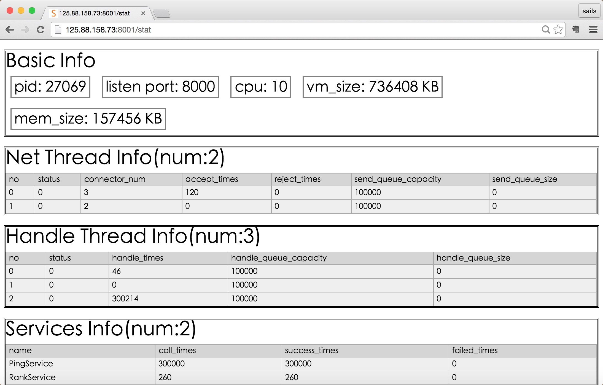

saf
===

saf application framework

## 特点 ##

    1:基于google protobuf的rpc框架;
    2:内置简单的http server用于查看系统状态;
    3:模块化的管理,只用在lib中增加动态库就可以达到增加rpc service的目的;
    4:sdk支持同步和异步调用模式、断线自动重连、调用超时设置;(查看example/rpcping/client.cc)

## 结构 ##

                                                                 +--------------+
    +-----------+      +------------+                           /|              |
    |           |      |            |                          / | Handle Thread| --->-
    |Net Thread \----->|   Decode   |\                        /  +--------------+     |
    +-----------+\     +------------+ \  +-----------------+ /   +--------------+     |
                  \                    \>|                 |/    |              |     |
                   \                   />|      queue      +-----+ Handle Thread+---->+
    +-----------+   \  +------------+ /  +-----------------+\    +--------------+     |
    |           |    \ |            |/                       \   +--------------+     |
    |Net Thread +----+>+   Decode   /                         \  |              |     |
    +-----------+     \+------------+                          \ | Handle Thread|     |
              \        \                                         +---------+----+     |
               \        \                                                  |          |
                \        \                                                 |          |
                 \     +--\---------+                                      |          |
                  \    |            |<-------------------------------------+          |
                   \   |   Encode   |                                                 |
                    \  +------------+                                                 |
                     \ +------------+                                                 |
                      \|            |                                                 |
                       \   Encode   +<------------------------------------------------+
                       +------------+

## 编译例子 ##

它依赖protobuf公共库,所以先安装protobuf3.0及以上版本，安装protobuf参照：

    https://github.com/google/protobuf

1:下载源码

    git clone --recursive https://github.com/sails/saf.git
2:执行编译脚本:

    ./build.sh
3:编译测试样例:

    cd example
    ./build_test.sh
4:运行测试,比如运行echo_sync:

    ./src/server
    ./example/echo_sync/client

5:增加子模块,配置conf/sails.json:
在modules里增加一行,name是子模块名,path是子模块动态库的路径

## 性能 ##

### 测试一 ###

编译选项：-O0, 四核八线程cpu
服务端和客户端都运行在这台电脑上,每个客户端同步调用10w次

    | net thread | handle thread | clients |  times |    tps |
    |------------+---------------+---------+--------+--------|
    |          1 |             1 |       1 |  9.097 |  11000 |
    |          1 |             1 |      30 | 37.986 |  79000 |
    |          2 |             1 |      30 | 33.872 |  88000 |
    |          2 |             2 |      30 | 22.302 | 135000 |
    |          2 |             4 |      60 | 37.841 | 158000 |
    |          3 |             3 |      60 | 34.312 | 175000 |
    |          4 |             4 |     100 | 50.117 | 200000 |
    |          4 |             8 |     100 | 48.383 | 207000 |

通过测试可知，在一台普通的四核八线程服务器上，基本上能达到20w/s的速度
(单独测试protobuf时，10w次序列化和反序列化用时2s)

## 统计 ##
内置http服务器的默认绑定在端口8001上,所以可以通过输入localhost:8001/stat来查看统计信息:

